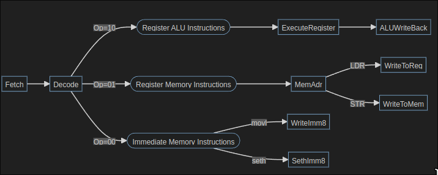

# Report 

<!-- Your text goes here. Remember to check the result of your CI to see whether 
the final PDF rendered correctly! -->

## Overview
To extend the QuAC ISA, I altered the microarchitecture of the lab cpu to utilize multicycle michroarchitecture over single-cycle to produce potential for further extension of the QuAC ISA via instructions with multiple 16-bit encodings or instructions that need multiple cycles. The implemented design draws inspiration from multicycle rudiments tailored towards base QuAC. Its design is modelled using a finite collection of hard-coded and combinatronic states needed for QuAC implementation. The highlights of this design is the reuse of expensive hardware and the ease to implement multiple 8-bit immediate or register and immediate ALU instructions. Its main pitfall is in its speed.

## Design and Inspiration
This extension to the QuAC ISA isn't immediately pertinant. Rather, it provides the framework that allows complex instructions within QuAC. When compared to the single-cycle cpu from labs, a larger portion of commercial ISA's instructions are implementable without alterations to the respective datapath. The simplest prove to the claim would be the max number of inputs for an instruction. Data can be read for multiple cycles prior to execution thus the only restriction to instruction size is the available ram. Multiple clock cycles also allows lowers the overall cost of the device.

Using multicycle microarchitecture is significantly cheaper than single-cycle. It facilitates reusing expensive hardware many times in a single instruction. This allows restriction to any budget and goes way beyond what's relevant to QuAC extension. Hardware reuse will be enforced to adders and memory because they're the most expensive elements relevant.

## Datapath Changes
To facilitate multiple cycles, the datapath gains 6 non-architectural registers that store values across cycles. The RAM changed from dual-port to single-port program count is incremented with ALU due to hardware reuse capabilities. The ALU and Register units remain unchanged except for the removal of logic that facilitated SETH in a single cycle. The control unit changed significantly and bears no resemblance to the single-cycle control unit.

Multicycle cpus have a primarily sequential control unit as to a single-cycle combinatronic control unit. In laymans terms, the next output of a multicycle cpu is constructed from the last output whereas the single-cycle cpu uses only instruction input. This type of sequential circuit is modelled with a Finite State Machine (FSM) where outputs are grouped by clock cycle and called a "state". Each state is then hardcoded and logic to select/transition states is created.

## Design and Implementation
The datapath is constructed before the control unit. It's construction followed textbook examples with modifications for QuAC. The first is the register-readable program counter and flag register. To facilitate pathing and aforementioned backwards compatability requirements, an alternate non-architectural flag register, an input to the register file for flag writes concurrent with the ALU, and an output from the register to expose the program counter for use during other instructions are added. The control unit is the successive design step.

Control units are complex so its design requires abstractions. With this in mind, I began mapping potential states by stepping through each instruction. The table of results is below. 

X is 0 or don't care, explicit 00 in a Src is due to the selection being active. 
|  | Fetch | ExecuteRegister | ALUWriteBack | MemAdr | WriteToReg | WriteToMem | WriteImm8 | SethImm8| 
|:---:|:---:|:---:|:---:|:---:|:---:|:---:|:---:|:---:|
| FlagW | X | 1 | X | X | X | X | X | X |
| RegSrc | X | 1 | X | X | X | X | X | X |
| MemWE | X | X | X | X | X | 1 | X | X |
| RegWE | 1 | X | 1 | X | 1 | X | 1 | 1 |
| ALUWE | X | 1 | X | 1 | X | X | X | X |
| InstWE | 1 | X | X | X | X | X | X | X |
| MemSrc | X | X | X | 1 | X | 1 | X | X |
| ALUSrcA | 00 | 01 | X | 10 | X | X | 10 | 01| 
| ALUSrcB | 10 | 00 | X | 00 | X | X | 01 | 11 |
| ResSrc | 10 | X | 00 | 10 | 01 | 00 | 10 | 11 |
| ALUOP | 00 | ALUOP | X | 00 | X | X | 00 | 10 (AND)| 
| RegWS | 110 | X | RegWS | X | RegWS | X | RegWS | RegWS |

All the control lines can be hardcoded except ALUOP and RegWS which require combinatronic input. This has conflicts for modelling. The resolving decision was making a seperate combinatronic unit that operated after a main FSM. The majority of control lines are encoded with a Moore-Machine FSM, and the two remaining by combinatronic logic.

Derived from the table is the control flow displayed in the graph below.

The circular nodes are added for readability and are not states. The text on transitions indicate needed combinatoric input.

I encoded the states using PLA logic in the Output FSM embedded circuit. The next state logic is combinatronic and encoded in the Next_State_FSM circuit.

## Testing 
I converted every test to multicycle execution by inserting clock cycles. For most tests errors presented themselves.

Some were simple like R-Format ALU instructions using rb which was solved by a multiplexer switched inputs to the register.

The most complex was the str command. The tests were failing on any fetch subsequent a str. After debugging, it was due to the instruction register loading its value on the same clock cycle the ram updated. Due to timing, the instruction register would load the value being written to memory instead of the new instruction. 

The solution was to add a decode state after fetch. This meant no matter what memory was selected at the end of the previous cycle, the new instruction would be read. An updated table of states is below.

|  | Fetch | ExecuteRegister | ALUWriteBack | MemAdr | WriteToReg | WriteToMem | WriteImm8 | SethImm8 | Decode |
|:---:|:---:|:---:|:---:|:---:|:---:|:---:|:---:|:---:|:---:|
| FlagW | X | 1 | X | X | X | X | X | X | X |
| RegSrc | X | 1 | X | X | X | X | X | X | X |
| MemWE | X | X | X | X | X | 1 | X | X | X |
| RegWE | 1 | X | 1 | X | 1 | X | 1 | 1 | X |
| ALUWE | X | 1 | X | 1 | X | X | X | X | X |
| InstWE | 1 | X | X | X | X | X | X | X | X |
| MemSrc | X | X | X | 1 | X | 1 | X | X | 1 |
| ALUSrcA | 00 | 01 | X | 10 | X | X | 10 | 01 | X |
| ALUSrcB | 10 | 00 | X | 00 | X | X | 01 | 11 | X |
| ResSrc | 10 | X | 00 | 10 | 01 | 00 | 10 | 11 | X |
| ALUOP | 00 | ALUOP | X | 00 | X | X | 00 | 10 (AND) | X |
| RegWS | 110 | X | RegWS | X | RegWS | X | RegWS | RegWS | X |

## Analysis and Tradeoffs
The additional registers and i/o for backwards compatability is easily criticized for straying from multicycle principles. The critique is somehat unfounded as the implementation of their behaviours without these additions creates a multitude of unneccesary complexity. With no strict restrictions to the design, creating additional complexity to save a register unreasoned. There's plenty else to critique the design over.

Despite each clock cycle being simpler and potentially quicker to execute than in a single-cycle, there is an overhead cost paid out every cycle. In terms of speed, a pipelined single-cycle isn't going to be trumped by a multicycle cpu. The cpu I've designed is easily the slowest with very few seperations in each cycle. However, my extension is a baseline for allowing complexity into a simple-to-make cpu. Judging its speed is enigmatic.

Ultimately, this cpu is an example of multicycle microarchitecture that fully implements the QuAC isa. Whilst it does have logically duplicate flag registers and ALU usage on the majority of cycles, it creates huge possibilities to an ISA restricted to 16-bits of instruction encoding. 